# Price Comparison Tool

A modern, full-stack web application that enables users to compare product prices across multiple merchant APIs simultaneously. Built with FastAPI and vanilla JavaScript, this tool provides real-time price comparison capabilities with comprehensive API endpoint management.

## 🎯 Project Background

This application was developed as a comprehensive solution for comparing product prices across different merchant platforms. The system architecture emphasizes:

- **Concurrent API Processing**: Utilizes Python's asyncio and aiohttp for simultaneous API calls
- **Merchant Agnostic Design**: Supports diverse API response formats through configurable parsing
- **Best Price Logic**: Automatically identifies the lowest price from in-stock items only
- **Real-time Management**: Complete CRUD operations for API endpoint configuration
- **Responsive Interface**: Modern, mobile-friendly web interface with real-time updates

The tool comes pre-configured with three HEB platform interview APIs (Appedia, Micromazon, and Googdit) but can be extended to support any number of merchant APIs.

## 🏗️ Architecture Overview

```mermaid
sequenceDiagram
    participant User as 👤 User
    participant Frontend as 🌐 Frontend
    participant Backend as ⚡ FastAPI Backend
    participant DB as 🗄️ SQLite DB
    participant API1 as 🏪 Merchant API 1
    participant API2 as 🏪 Merchant API 2
    participant API3 as 🏪 Merchant API 3

    User->>Frontend: Enter UPC & Click Compare
    Frontend->>Backend: POST /api/compare {upc}
    Backend->>DB: Query active API endpoints
    DB-->>Backend: Return active endpoints list
    
    par Concurrent API Calls
        Backend->>API1: GET /endpoint1/{upc}
        Backend->>API2: GET /endpoint2/{upc}
        Backend->>API3: GET /endpoint3/{upc}
    end
    
    par API Responses
        API1-->>Backend: {price, stock, format1}
        API2-->>Backend: {price, available, format2}
        API3-->>Backend: {price, locations, format3}
    end
    
    Backend->>Backend: Parse responses by merchant type
    Backend->>Backend: Filter in-stock items
    Backend->>Backend: Calculate best price
    Backend-->>Frontend: Return comparison results
    Frontend->>Frontend: Display results with best price highlighted
    Frontend-->>User: Show price comparison table
```



## ✨ Features

### Core Functionality
- **Multi-Merchant Price Comparison**: Simultaneous price queries across all active APIs
- **Intelligent Best Price Detection**: Considers only in-stock items for best price calculation
- **Real-time Results**: Live price comparison with immediate feedback
- **Stock Availability Tracking**: Shows in-stock/out-of-stock status for each merchant
- **Error Handling**: Graceful handling of API timeouts, errors, and malformed responses

### API Management
- **Complete CRUD Operations**: Create, read, update, and delete merchant API endpoints
- **Dynamic API Configuration**: Add new merchants without code changes
- **Active/Inactive Toggle**: Enable/disable APIs for comparison
- **URL Template System**: Support for {upc} placeholder in API endpoints
- **Status Monitoring**: Visual indicators for API endpoint status

### User Interface
- **Modern Design**: Clean, responsive interface with modern styling
- **Mobile Optimization**: Fully functional on mobile devices
- **Real-time Feedback**: Loading states, success messages, and error notifications
- **Keyboard Shortcuts**: Escape key support and form navigation
- **Best Price Highlighting**: Visual emphasis on the lowest price found

## 🛠️ Technology Stack

### Backend
- **FastAPI**: High-performance async web framework with automatic API documentation
- **Python 3.8+**: Modern Python with async/await support
- **SQLite**: Lightweight database for API endpoint storage
- **aiohttp**: Async HTTP client for concurrent API requests
- **aiosqlite**: Async SQLite driver for non-blocking database operations
- **Pydantic**: Data validation and serialization with type hints

### Frontend
- **Vanilla JavaScript**: Modern ES6+ without framework dependencies
- **CSS Grid/Flexbox**: Responsive layout system
- **Fetch API**: Modern HTTP client for API communication
- **Local Storage**: Client-side state management

### Development Tools
- **uvicorn**: ASGI server with hot reload for development
- **pytest**: Comprehensive testing framework
- **Custom Scripts**: Automated startup and testing scripts

## 🚀 Quick Start

### Prerequisites

- **Python 3.8+**: Required for async/await and modern features
- **pip3**: Python package manager
- **git**: Version control system
- **Operating System**: macOS, Linux, or Windows

### Clone the Repository

```bash
# Clone the repository from GitHub
git clone https://github.com/ahearnz12/Price_Comparison_Tool.git

# Navigate to the project directory
cd Price_Comparison_Tool
```

### Installation & Setup

#### Option 1: Automated Setup (macOS/Linux)
```bash
# Make startup script executable
chmod +x run.sh

# Start both servers automatically
./run.sh
```

#### Option 2: Manual Setup (All Platforms)
```bash
# 1. Install backend dependencies
cd backend
pip3 install -r requirements.txt

# 2. Start FastAPI backend server
python3 -m uvicorn main:app --host 0.0.0.0 --port 8000 --reload &

# 3. Start frontend server (in new terminal)
cd ../frontend
python3 server.py
```

#### Option 3: Production Setup
```bash
# Install dependencies
cd backend && pip3 install -r requirements.txt

# Start backend without reload
python3 -m uvicorn main:app --host 0.0.0.0 --port 8000 --no-use-colors

# Start frontend (separate terminal)
cd frontend && python3 server.py
```

### Access Points

Once running, access the application at:

- **🌐 Frontend Application**: http://localhost:3010
- **⚡ Backend API**: http://localhost:8000
- **📚 Interactive API Docs**: http://localhost:8000/docs
- **🩺 Health Check**: http://localhost:8000/api/health

## 📖 Usage Guide

### Price Comparison Workflow

1. **Enter Product UPC**: Input a valid UPC code (e.g., 101, 123456789012)
2. **Initiate Comparison**: Click "Compare Prices" to start the process
3. **View Results**: Review prices from all active merchants
4. **Identify Best Deal**: Best price is automatically highlighted with a trophy icon
5. **Check Stock Status**: Green dot = in stock, yellow dot = out of stock

### API Endpoint Management

#### Adding New Merchant APIs
1. Click **"Add API"** button in the API Management section
2. Fill in the required information:
   - **API Name**: Descriptive name for the merchant (e.g., "Amazon API")
   - **URL Template**: API endpoint with `{upc}` placeholder
   - **Active Status**: Enable/disable for price comparisons
3. Click **"Add API"** to save the configuration

#### Editing Existing APIs
1. Click the **edit button (✏️)** next to any API
2. Modify the desired fields
3. Click **"Update API"** to save changes

#### Managing API Status
- **Toggle On/Off**: Use the Enable/Disable button to activate/deactivate APIs
- **Delete APIs**: Use the delete button (🗑️) to permanently remove APIs
- **Status Indicators**: Green dot = active, gray dot = inactive

### API URL Template Examples

```bash
# Query parameter format
https://api.merchant.com/products?upc={upc}&format=json

# Path parameter format  
https://api.merchant.com/product/{upc}/details

# Complex template with multiple parameters
https://api.merchant.com/v2/products/{upc}?include=price,stock&format=json
```

## 📁 Project Structure

```
Price_Comparison_Tool/
├── README.md                    # This comprehensive guide
├── run.sh                       # macOS/Linux startup script
├── run_tests.sh                 # Test execution script
├── .gitignore                   # Git ignore configuration
├── backend/
│   ├── main.py                  # FastAPI application core
│   ├── requirements.txt         # Python dependencies
│   └── api_endpoints.db         # SQLite database (auto-created)
├── frontend/
│   ├── index.html               # Complete web application
│   └── server.py                # Python HTTP server with CORS
├── tasks/
│   └── todo.md                  # Project planning and analysis
└── tests/
    ├── __init__.py              # Test package initialization
    ├── requirements.txt         # Test dependencies
    └── test_api_parsing.py      # Comprehensive test suite
```

## 🔌 API Reference

### Price Comparison Endpoints

#### Compare Prices
```http
POST /api/compare
Content-Type: application/json

{
  "upc": "123456789012"
}
```

**Response:**
```json
{
  "upc": "123456789012",
  "results": [
    {
      "merchant": "Appedia",
      "price": 4.77,
      "url": "https://appedia.heb-platform-interview.hebdigital-prd.com/api/v1/itemdata?upc=123456789012",
      "error": null,
      "in_stock": true
    }
  ],
  "best_price": 4.77,
  "best_merchant": "Appedia",
  "best_url": "https://...",
  "comparison_time": "2024-01-15T10:30:00"
}
```

### API Management Endpoints

#### List All Endpoints
```http
GET /api/endpoints
```

#### Get Specific Endpoint
```http
GET /api/endpoints/{id}
```

#### Create New Endpoint
```http
POST /api/endpoints
Content-Type: application/json

{
  "name": "New Merchant API",
  "url": "https://api.merchant.com/product/{upc}",
  "is_active": true
}
```

#### Update Endpoint
```http
PUT /api/endpoints/{id}
Content-Type: application/json

{
  "name": "Updated Name",
  "url": "https://api.updated.com/product/{upc}",
  "is_active": false
}
```

#### Toggle Endpoint Status
```http
PATCH /api/endpoints/{id}/toggle
```

#### Delete Endpoint
```http
DELETE /api/endpoints/{id}
```

### Utility Endpoints

#### Health Check
```http
GET /api/health
```

#### API Information
```http
GET /
```

## 🏪 Default Merchant APIs

The application includes three pre-configured HEB platform interview APIs:

### Appedia
- **URL**: `https://appedia.heb-platform-interview.hebdigital-prd.com/api/v1/itemdata?upc={upc}`
- **Format**: `{"price": "$4.77", "stock": 7}`
- **Stock Logic**: `stock > 0`

### Micromazon  
- **URL**: `https://micromazon.heb-platform-interview.hebdigital-prd.com/{upc}/productinfo`
- **Format**: `{"available": true, "price": 5.67}`
- **Stock Logic**: `available === true`

### Googdit
- **URL**: `https://googdit.heb-platform-interview.hebdigital-prd.com/{upc}`
- **Format**: `{"a": [{"l": 8839, "q": 4}], "p": 478000000}`
- **Stock Logic**: `any location has q > 0`
- **Price Conversion**: `p / 100000000.0` (microcents to dollars)

## ⚙️ Configuration

### Environment Variables

```bash
# Database configuration
DATABASE_URL=api_endpoints.db

# Server ports
BACKEND_PORT=8000
FRONTEND_PORT=3010

# Development settings
UVICORN_RELOAD=true
LOG_LEVEL=info
```

### Database Schema

```sql
CREATE TABLE api_endpoints (
    id INTEGER PRIMARY KEY AUTOINCREMENT,
    name TEXT NOT NULL,
    url TEXT NOT NULL,
    is_active BOOLEAN DEFAULT TRUE,
    created_at TIMESTAMP DEFAULT CURRENT_TIMESTAMP,
    updated_at TIMESTAMP DEFAULT CURRENT_TIMESTAMP
);
```

## 🧪 Testing

### Running Tests

```bash
# Run all tests with detailed output
./run_tests.sh

# Run tests manually
python3 -m pytest tests/ -v

# Run specific test modules
python3 -m pytest tests/test_api_parsing.py -v
```

### Test Coverage

The test suite includes comprehensive coverage for:

- **API Response Parsing**: All three merchant format parsers
- **Stock Logic Validation**: In-stock/out-of-stock detection
- **Best Price Calculation**: Only in-stock items considered
- **Error Handling**: Malformed responses, timeouts, HTTP errors
- **Integration Testing**: End-to-end price comparison workflow
- **Edge Cases**: Empty responses, invalid data types, missing fields

### Test Structure

```bash
tests/
├── test_api_parsing.py          # Core parsing and logic tests
├── test_best_price_logic.py     # Best price calculation tests  
└── test_integration.py          # End-to-end integration tests
```

## 🔧 Development

### Backend Development

```bash
# Install development dependencies
cd backend
pip3 install -r requirements.txt

# Start with hot reload
python3 -m uvicorn main:app --host 0.0.0.0 --port 8000 --reload

# View API documentation
open http://localhost:8000/docs
```

### Frontend Development

```bash
# Start frontend server
cd frontend
python3 server.py

# Access application
open http://localhost:3010
```

### Adding New Merchant Support

1. **Update Parser Function**: Add new case in `parse_api_response()` in `main.py`
2. **Define Response Format**: Document the expected JSON structure
3. **Implement Stock Logic**: Define how to determine product availability
4. **Add Tests**: Create test cases for the new merchant format
5. **Configure via UI**: Add the new API endpoint through the web interface

Example merchant parser addition:
```python
def parse_api_response(merchant_name: str, data: dict) -> tuple[Optional[float], bool]:
    if merchant_name.lower() == "newmerchant":
        # NewMerchant format: {"cost": 12.99, "available": "yes"}
        price = data.get("cost")
        available = data.get("available") == "yes"
        
        if price is not None:
            return float(price), available
    
    # ... existing merchants
    return None, False
```

## 🔒 Security Features

### Input Validation
- **Pydantic Models**: Strict type checking and validation for all API inputs
- **SQL Injection Prevention**: Parameterized queries with aiosqlite
- **XSS Protection**: Input sanitization and validation
- **Request Size Limits**: Protection against oversized requests

### CORS Configuration
- **Restricted Origins**: Limited to localhost development ports
- **Secure Headers**: Proper CORS headers for cross-origin requests
- **Method Restrictions**: Limited to necessary HTTP methods

### Error Handling
- **Information Disclosure**: Generic error messages for security
- **Timeout Protection**: Request timeouts prevent hanging connections
- **Rate Limiting Ready**: Architecture supports rate limiting implementation

## 🚨 Troubleshooting

### Common Issues

#### Port Already in Use
```bash
# The startup script automatically handles this, but manual cleanup:
lsof -ti :8000 | xargs kill -9  # Kill backend
lsof -ti :3010 | xargs kill -9  # Kill frontend
```

#### Dependencies Missing
```bash
# Reinstall all dependencies
cd backend && pip3 install -r requirements.txt
cd ../tests && pip3 install -r requirements.txt
```

#### Python Version Issues
```bash
# Check Python version (requires 3.8+)
python3 --version

# Use specific Python version if multiple installed
python3.9 -m uvicorn main:app --port 8000
```

#### Database Corruption
```bash
# Reset database (loses all custom API configurations)
rm backend/api_endpoints.db
# Restart application to recreate with defaults
```

#### API Connection Failures
1. **Check Internet Connection**: Ensure connectivity to merchant APIs
2. **Verify API URLs**: Confirm merchant endpoints are still valid
3. **Review Logs**: Check console output for specific error messages
4. **Test Individual APIs**: Use browser/curl to test API endpoints directly

### Debugging

#### Backend Debugging
```bash
# Enable verbose logging
LOG_LEVEL=debug python3 -m uvicorn main:app --port 8000

# Test API endpoints directly
curl http://localhost:8000/api/health
curl -X POST http://localhost:8000/api/compare -H "Content-Type: application/json" -d '{"upc":"101"}'
```

#### Frontend Debugging
- **Browser Console**: Check for JavaScript errors and network issues
- **Network Tab**: Monitor API requests and responses
- **Application Tab**: Inspect local storage and session data

## 🚀 Performance Optimization

### Backend Optimizations
- **Async Operations**: All database and HTTP operations are asynchronous
- **Connection Pooling**: Efficient database connection management
- **Request Timeouts**: 10-second timeout prevents hanging requests
- **Concurrent API Calls**: Simultaneous merchant API requests

### Frontend Optimizations
- **Minimal JavaScript**: No heavy frameworks, optimized vanilla JS
- **CSS Grid/Flexbox**: Efficient responsive layouts
- **Event Delegation**: Optimized event handling
- **Lazy Loading**: Results loaded only when needed

## 📈 Monitoring & Analytics

### Health Monitoring
```bash
# Check application health
curl http://localhost:8000/api/health

# Monitor active endpoints
curl http://localhost:8000/api/endpoints
```

### Logging
- **Backend Logs**: Detailed request/response logging to console
- **Error Tracking**: Comprehensive error logging with context
- **Performance Metrics**: Request timing information

## 🤝 Contributing

### Development Workflow
1. **Fork Repository**: Create your own fork for development
2. **Create Feature Branch**: `git checkout -b feature/new-merchant-support`
3. **Implement Changes**: Add new features or fix bugs
4. **Write Tests**: Ensure comprehensive test coverage
5. **Run Test Suite**: `./run_tests.sh` to verify all tests pass
6. **Submit Pull Request**: Create PR with detailed description

### Code Standards
- **Type Hints**: Use Python type hints throughout
- **Async/Await**: Prefer async operations for I/O
- **Error Handling**: Comprehensive try/catch blocks
- **Documentation**: Clear docstrings and comments
- **Testing**: Unit tests for all new functionality

### Merchant API Integration Guidelines
1. **Response Format Documentation**: Clearly document expected JSON structure
2. **Stock Logic Definition**: Define availability determination logic
3. **Error Handling**: Handle edge cases and malformed responses
4. **Test Coverage**: Include comprehensive test cases
5. **Performance Consideration**: Ensure parsing efficiency

## 📄 License

This project is open source and available under the MIT License.

```
MIT License

Permission is hereby granted, free of charge, to any person obtaining a copy
of this software and associated documentation files (the "Software"), to deal
in the Software without restriction, including without limitation the rights
to use, copy, modify, merge, publish, distribute, sublicense, and/or sell
copies of the Software, and to permit persons to whom the Software is
furnished to do so, subject to the following conditions:

The above copyright notice and this permission notice shall be included in all
copies or substantial portions of the Software.

THE SOFTWARE IS PROVIDED "AS IS", WITHOUT WARRANTY OF ANY KIND, EXPRESS OR
IMPLIED, INCLUDING BUT NOT LIMITED TO THE WARRANTIES OF MERCHANTABILITY,
FITNESS FOR A PARTICULAR PURPOSE AND NONINFRINGEMENT.
```

## 🆘 Support & Contact

### Getting Help
1. **Check Documentation**: Review this README and API docs at `/docs`
2. **Check Logs**: Examine console output for error messages
3. **Run Tests**: Use `./run_tests.sh` to verify system functionality
4. **Health Check**: Verify API health at `/api/health`

### Reporting Issues
When reporting issues, please include:
- **Operating System**: macOS, Linux, or Windows version
- **Python Version**: Output of `python3 --version`
- **Error Messages**: Complete error output from console
- **Steps to Reproduce**: Detailed steps that trigger the issue
- **Expected Behavior**: What you expected to happen

### Technical Support
- **API Documentation**: http://localhost:8000/docs (when running)
- **Source Code**: Available in project repository
- **Test Suite**: Comprehensive tests in `tests/` directory

---

**Last Updated**: December 2024  
**Version**: 1.0.0  
**Compatibility**: Python 3.8+, Modern Web Browsers